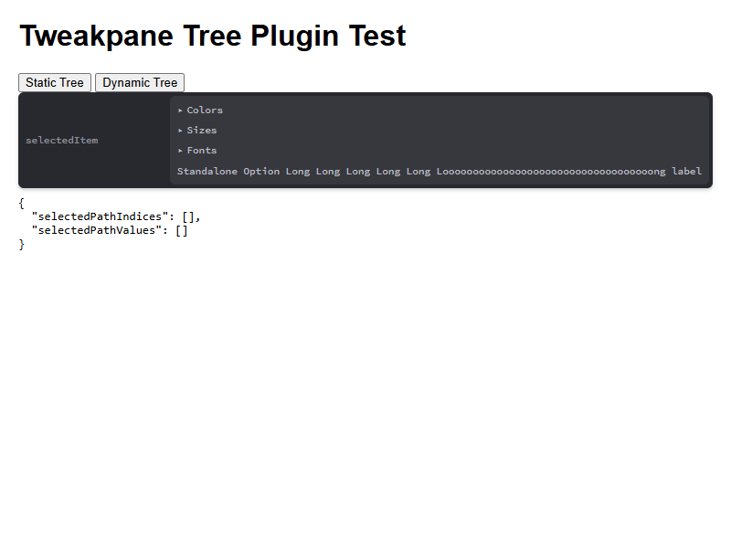
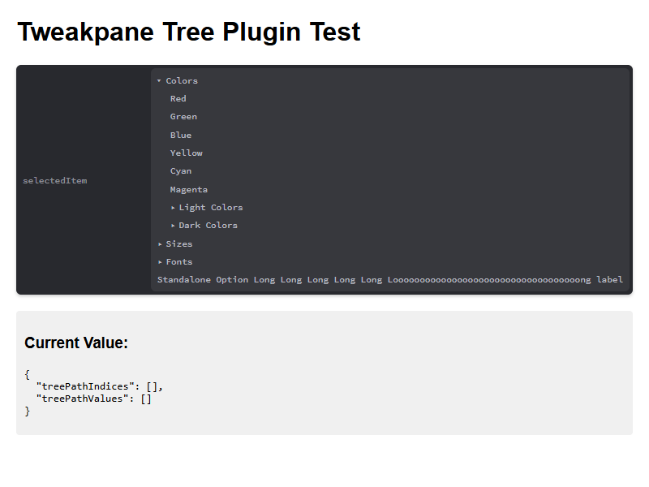
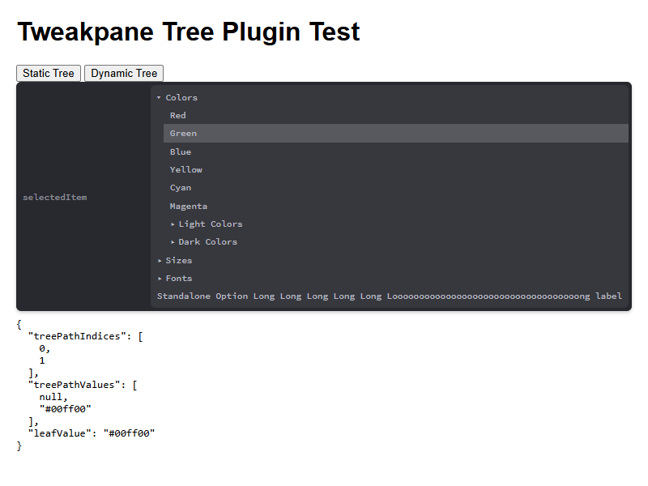

# tweakpane-tree

A tree input plugin for [Tweakpane](https://tweakpane.github.io/docs/) that allows users to select items from a hierarchical tree structure.

## Features

- **Hierarchical Tree Structure**: Support for arbitrarily nested tree nodes
- **Native HTML Elements**: Uses `<details>` and `<summary>` elements for native expand/collapse behavior
- **Type-Safe**: Fully typed TypeScript implementation
- **Path Tracking**: Returns complete path information including indices, values, and leaf value
- **Dynamic trees & DOM diffing**: The view attempts to reuse existing DOM elements when rebuilding the tree to reduce reflows and preserve element identity — see `docs/dynamic-trees.md` for details.

## Installation

### Browser

```html
<script type="module">
  import {Pane} from 'tweakpane';
  import * as TweakpaneTreePlugin from 'tweakpane-plugin-tree';

  const pane = new Pane();
  pane.registerPlugin(TweakpaneTreePlugin);
</script>
```

### Package

```js
import {Pane} from 'tweakpane';
import * as TreePlugin from 'tweakpane-plugin-tree';

const pane = new Pane();
pane.registerPlugin(TreePlugin);
```

## Usage

```js
const params = {
  selectedItem: {
    selectedPathIndices: [],
    selectedPathValues: [],
    selectedLeafValue: undefined
  }
};

pane.addBinding(params, 'selectedItem', {
  view: 'tree',
  children: [
    {
      label: 'Colors',
      children: [
        { label: 'Red', value: '#ff0000' },
        { label: 'Green', value: '#00ff00' },
        { label: 'Blue', value: '#0000ff' }
      ]
    },
    {
      label: 'Sizes',
      children: [
        { label: 'Small', value: 10 },
        { label: 'Medium', value: 20 },
        { label: 'Large', value: 30 }
      ]
    }
  ]
}).on('change', (ev) => {
  console.log(ev.value);
  // {
  //   selectedPathIndices: [0, 1],
  //   selectedPathValues: [null, '#00ff00'],
  //   selectedLeafValue: '#00ff00'
  // }
});
```

## Tree Structure

### Tree Options (Leaf Nodes)

Leaf nodes represent selectable items:

```typescript
{
  label: string;    // Display text
  value?: unknown;  // Optional value associated with this item
}
```

### Tree Nodes (Branch Nodes)

Branch nodes contain children and can optionally be selectable themselves:

```typescript
{
  label: string;           // Display text
  children: TreeChildren;  // Array of child options or nodes
  value?: unknown;         // Optional value associated with this node
}
```

## Bound Value

When you bind a tree input, the external value has the following structure:

```typescript
{
  selectedPathIndices: number[];  // Array of indices representing the path from root to selected item
  selectedPathValues: unknown[];  // Array of values at each level of the path
  selectedLeafValue: unknown;     // The value of the selected leaf item
}
```

### Reading and Writing

- **Reading**: Only the `selectedPathIndices` property is read from the bound object
- **Writing**: All three properties (`selectedPathIndices`, `selectedPathValues`, `selectedLeafValue`) are written to the bound object

## Example

See the [test page](test/browser.html) for a complete working example.

## Screenshots

### Initial State


### Expanded Tree


### Nested Selection


## Build / dev / test workflows

- Install deps: `npm install` (repository uses npm; devDependencies are listed in `package.json`).
- Dev server: `npm run dev` or `npm start` — runs the Vite dev server and opens `test/browser.html` for quick visual debugging.
- Build (dev): `npm run build:dev` — Vite build (unminified output).
- Build (prod): `npm run build:prod` — Vite build in production mode (minified). The convenience script `npm run build` runs both `build:dts` and Vite builds in parallel.
 - Type definitions: `npm run build:dts` runs `tsc --project src/tsconfig-dts.json` to emit `.d.ts` files into `dist/types`.
 - Lint: `npm run lint` — runs `eslint` (fast check; use this for CI and local validation).
 - Test: `npm test` — runs `ts-node test/visual-test.ts`, a visual-regression test that:

 	- starts a Vite dev server rooted at `test/` (default port 7357)
 	- launches Puppeteer to open `test/browser.html`
 	- captures screenshots into `test/__screenshots__` and compares them against baselines using `looks-same`
 	- writes diff images to `test/__screenshots__` when mismatches are found and exits non-zero on failure

 	Use `npm test -- --accept` to accept and overwrite baseline screenshots, or `npm test -- --only-server` to start the server without running the browser checks.

 	Note: The repository also contains experimental Vitest tests (`npm run test-vitest`) that were added as an experiment; they are incomplete and flaky and should be ignored for CI/publishing.

 - Packaging helpers: after build, `npm run assets` will append versions and create zip artifacts.

## Troubleshooting — visual tests & Puppeteer

If `npm test` fails or behaves unexpectedly, try these steps:

- Quick checks:
  - Make sure you ran `npm install` and that the `puppeteer` Chromium binary exists (look for `node_modules/puppeteer/.local-chromium`).
  - Run `npm test -- --only-server` and open `http://localhost:7357/test/browser.html` to inspect the page manually.

- CI / headless environments:
  - Some CI runners need additional system libraries for Chromium. On Linux, install deps like `libnss3`, `libx11-6`, `libxcomposite1`, `libxrandr2`, `libasound2`, and fonts.
  - On GitHub Actions, `ubuntu-latest` usually includes Chrome. Otherwise install Chrome/Chromium and set `PUPPETEER_EXECUTABLE_PATH` to the binary path.
  - If the runner blocks sandboxing, run Chromium with `--no-sandbox --disable-setuid-sandbox` (configure your CI container or use a Docker image that allows this).

- Troubleshooting diffs:
  - Baseline screenshots live in `test/__screenshots__/s-<slug>.png`. New runs create `s-<slug>-new.png` and diff images `s-<slug>-diff.png` when mismatches occur.
  - Use `npm test -- --accept` to accept intentional UI changes and overwrite baselines.

- Flakiness & rendering differences:
  - Visual tests can fail due to fonts, OS-level rendering differences, or network timing. Use `--only-server` to inspect and stabilize resources, or add small waits in the test page.

Note: The Vitest experiments remain in the repo (`npm run test-vitest`), but they are experimental and not used for CI/publishing.

Notes: The CSS is compiled from `src/sass/plugin.scss` and inlined into the `css` export by the bundler at build time (see `vite.config.ts`). CI and prepublish steps call `npm test` (see `prepublishOnly`), so ensure lint passes before publishing.

## License

MIT
